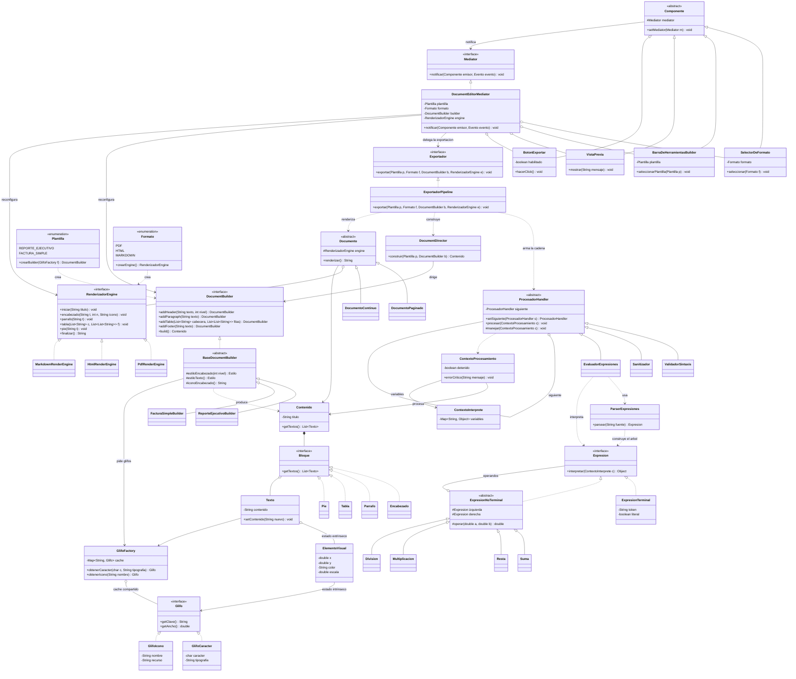
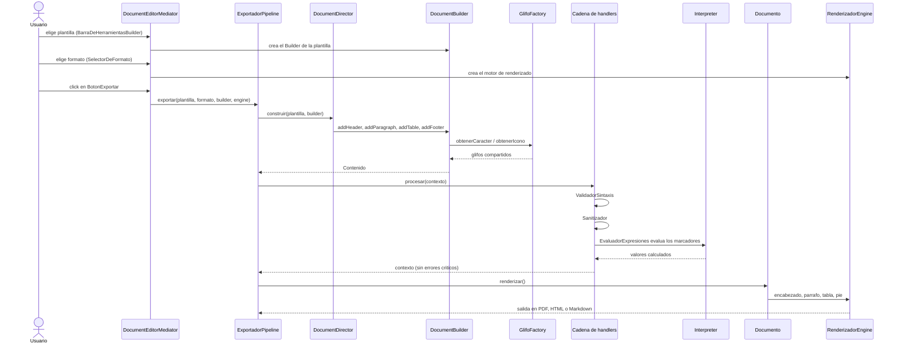

# Motor de Documentos Inteligentes

Actividad de integración de patrones (Modelos de Programación, Ingeniería de Sistemas, Universidad Distrital).
Implementación en Java que integra **Bridge, Builder, Chain of Responsibility, Flyweight, Interpreter y Mediator**.

## Estructura de paquetes

```
src/
├── app/           Main y ExportadorPipeline (orquesta el flujo completo)
├── mediator/      Mediator: DocumentEditorMediator y componentes de la interfaz
├── builder/       Builder: DocumentBuilder, builders concretos, Director y Plantilla
├── flyweight/     Flyweight: Glifo, GlifoFactory y ElementoVisual (estado extrínseco)
├── model/         Estructura del documento: Contenido, Bloque, Texto y derivados
├── chain/         Chain of Responsibility: ProcesadorHandler y manejadores
├── interpreter/   Interpreter: Expresion, terminales, no terminales y parser
└── bridge/        Bridge: Documento (abstracción) y RenderizadorEngine (implementación)
```

## Cómo se integran los patrones

| Patrón | Dónde | Papel en el sistema |
|---|---|---|
| Mediator | `DocumentEditorMediator` | Recibe los eventos de `SelectorDeFormato`, `BarraDeHerramientasBuilder`, `VistaPrevia` y `BotonExportar`; reconfigura el Builder y el Renderizador. |
| Builder | `DocumentBuilder`, `ReporteEjecutivoBuilder`, `FacturaSimpleBuilder`, `DocumentDirector` | Ensambla el `Contenido` paso a paso, independiente del formato final. |
| Flyweight | `GlifoFactory`, `GlifoCaracter`, `GlifoIcono`, `ElementoVisual` | El Builder pide los glifos a la fábrica; el estado intrínseco se comparte y la posición, el color y la escala quedan en `ElementoVisual`. |
| Chain of Responsibility | `ValidadorSintaxis` → `Sanitizador` → `EvaluadorExpresiones` | Procesa el `Contenido` antes de renderizar; un error crítico interrumpe la cadena. |
| Interpreter | `ExpresionTerminal`, `ExpresionNoTerminal` (`Suma`, `Resta`, `Multiplicacion`, `Division`), `ParserExpresiones` | El `EvaluadorExpresiones` lo usa para calcular los marcadores `#{...}`. |
| Bridge | `Documento` (`DocumentoPaginado`, `DocumentoContinuo`) y `RenderizadorEngine` (`PdfRenderEngine`, `HtmlRenderEngine`, `MarkdownRenderEngine`) | Permite combinar cualquier tipo de documento con cualquier formato de salida. |

## Compilar y ejecutar

Linux / macOS:

```bash
mkdir -p out
javac -encoding UTF-8 -d out $(find src -name "*.java")
java -cp out app.Main
```

Windows (PowerShell):

```powershell
mkdir out
Get-ChildItem -Recurse src -Filter *.java | ForEach-Object { $_.FullName } | Out-File -Encoding ascii sources.txt
javac -encoding UTF-8 -d out "@sources.txt"
java -cp out app.Main
```

Requiere Java 11 o superior. Los archivos generados quedan en la carpeta `salida/`.
El PDF es simulado: se escribe como texto con operadores tipo PDF (`.pdf.txt`).

## Flujo de la demo (`app.Main`)

1. **Mediator**: se configura plantilla y formato a través de los componentes; el botón se habilita solo cuando hay ambos.
2. **Builder + Flyweight**: el Director arma el documento y los caracteres e iconos repetidos se reutilizan (se imprimen las estadísticas).
3. **Chain of Responsibility**: validación, sanitización y evaluación de fórmulas.
4. **Interpreter**: se evalúan `#{FECHA_ACTUAL}`, `#{PRECIO_BASE * CANTIDAD}` y `#{PRECIO_BASE * 1.19 - DESCUENTO}`.
5. **Bridge**: el mismo contenido se renderiza en PDF, HTML y Markdown.
6. Caso de error: un marcador sin cerrar interrumpe la cadena y el documento no se renderiza.

## Diagrama de clases UML



## Diagrama de secuencia del flujo completo


